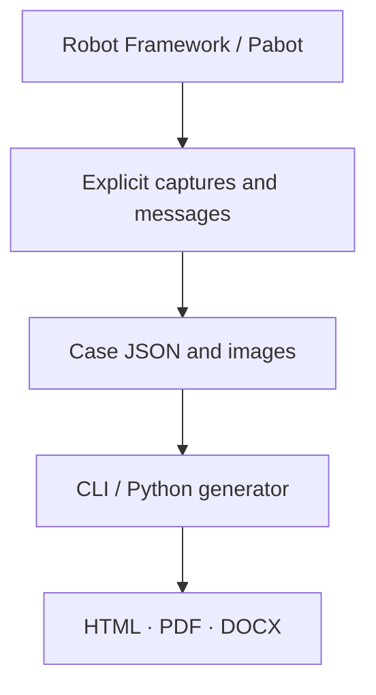

## Evidence that explains the result

<div class="er-section-intro" markdown>

A test tells you whether it passed. **Evidence tells the story.** Capture the moments that matter, give them business context and share a report your team can read without opening Robot logs.

</div>

<div class="grid cards" markdown>

-   :material-camera-outline:{ .card-icon } **Capture with intention**

    ---

    Record a page, element or desktop at the moment that matters. Add a title, description and evidence status.

    [Choose your capture](reference/keywords.html)

-   :material-timeline-check-outline:{ .card-icon } **Organize the story**

    ---

    Optional milestones connect screenshots and messages to a business stage. Direct evidence works just as well.

    [Explore milestones](guide.md#optional-milestones){ data-preview }

-   :material-file-document-multiple-outline:{ .card-icon } **Share in three formats**

    ---

    Interactive HTML, static PDF and editable Word. Reports include their images and can be read offline.

    [See the output](demo.md){ data-preview }

-   :material-palette-outline:{ .card-icon } **Make it yours**

    ---

    English or Spanish reports, light/dark HTML and optional institutional branding. All open and free.

    [Configure presentation](generation.md#report-design-and-institution-branding){ data-preview }

</div>

## One case. Three ways to share it.

=== "HTML"

    <div class="er-format-preview" markdown>

    [](demo/passed.html)

    </div>

    Explore Summary, Steps and Logs. Expand captures, filter messages and switch themes.

    [Open interactive HTML](demo/passed.html){ .md-button .md-button--primary }

=== "PDF"

    A portable document for reviews and evidence delivery. The same case, milestones and images, generated by the real export engine.

    [Open sample PDF](demo/passed.pdf){ .md-button .md-button--primary target="_blank" rel="noopener noreferrer" }

=== "Word"

    An editable document when your team needs to incorporate evidence into another deliverable.

    [Download sample Word](demo/passed.docx){ .md-button .md-button--primary }

!!! note "Real renderer, illustrative data"
    Samples are generated with Evidence Reporter's own engine. The customer data and images are fictitious. The hero is an explanatory animation; open a sample to use the actual report controls.

<div class="er-quickstart" markdown>

## Your first report, in three steps

=== "Install"

    ```bash
    pip install robotframework-evidence-reporter robotframework-seleniumlibrary
    ```

=== "Capture"

    Add the library to an existing Selenium suite and explicitly record the evidence:

    ```robotframework hl_lines="2 7"
    *** Settings ***
    Library    EvidenceReporter
    Library    SeleniumLibrary

    *** Test Cases ***
    Record Evidence In An Open Browser
        Capture Page Evidence    Portal available    status=PASS  # (1)!
    ```

    1. This excerpt assumes the suite has already opened a browser. `status=PASS` describes the capture; Robot determines the test result.

=== "Generate"

    ```bash
    robot --outputdir results tests/
    rf-evidence build results/evidence --output reports --formats html pdf docx
    ```

[Follow the complete example](getting-started.md){ .md-button .md-button--primary }

</div>

## Built for your automation workflow



<div class="grid cards" markdown>

-   :material-call-split: **Parallel execution**

    Separate case directories for Pabot, with evidence collected after execution.

    [Parallel and CI](parallel.md){ data-preview }

-   :material-source-merge: **Run + rerun**

    Merge attempts while keeping earlier evidence and the final result.

    [Merge executions](guide.md#combine-execution-and-rerun){ data-preview }

-   :material-code-json: **CLI and Python**

    Regenerate from recorded JSON and images without running tests again.

    [Generation API](generation.md){ data-preview }

</div>

[Browse guides by topic](topics.md){ .md-button }
[Explore all examples](demo.md){ .md-button }
