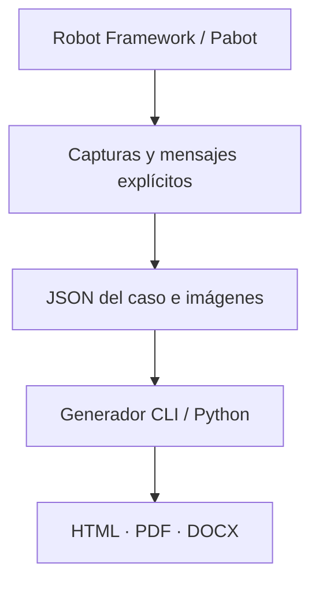

## Evidencia que explica el resultado

<div class="er-section-intro" markdown>

Una prueba indica si pasó. **La evidencia cuenta la historia.** Captura los momentos importantes, agrega contexto de negocio y comparte un reporte que tu equipo pueda leer sin abrir los logs de Robot.

</div>

<div class="grid cards" markdown>

-   :material-camera-outline:{ .card-icon } **Captura con intención**

    ---

    Registra una página, elemento o escritorio en el momento importante. Agrega título, descripción y estado de evidencia.

    [Elige tu captura](reference/keywords.html)

-   :material-timeline-check-outline:{ .card-icon } **Organiza la historia**

    ---

    Los hitos opcionales conectan capturas y mensajes con una etapa de negocio. También puedes guardar evidencia directa.

    [Explora los hitos](guide.md#hitos-opcionales){ data-preview }

-   :material-file-document-multiple-outline:{ .card-icon } **Comparte en tres formatos**

    ---

    HTML interactivo, PDF estático y Word editable. Los reportes incluyen sus imágenes y se pueden leer sin conexión.

    [Consulta las salidas](demo.md){ data-preview }

-   :material-palette-outline:{ .card-icon } **Dale tu identidad**

    ---

    Reportes en inglés o español, HTML claro/oscuro y marca institucional opcional. Todo abierto y gratuito.

    [Configura la presentación](generation.md#diseno-del-reporte-y-marca-institucional){ data-preview }

</div>

## Tres formas de compartir tu evidencia.

=== "HTML"

    <div class="er-format-preview" markdown>

    [](demo/es/passed.html)

    </div>

    Explora Resumen, Pasos y Logs. Amplía capturas, filtra mensajes y cambia de tema.

    [Abrir HTML interactivo](demo/es/passed.html){ .md-button .md-button--primary }

=== "PDF"

    Un documento portable para revisiones y entrega de evidencias. El mismo caso, hitos e imágenes, generado por el motor real de exportación.

    [Abrir PDF de ejemplo](demo/es/passed.pdf){ .md-button .md-button--primary target="_blank" rel="noopener noreferrer" }

=== "Word"

    Un documento editable cuando tu equipo necesita incorporar evidencia en otro entregable.

    [Descargar Word de ejemplo](demo/es/passed.docx){ .md-button .md-button--primary }

!!! note "Motor real, datos ilustrativos"
    Los ejemplos se generan con el motor de Evidence Reporter. Los datos de clientes y las imágenes son ficticios. Abre un ejemplo para explorar los controles del reporte.

<div class="er-quickstart" markdown>

## Tu primer reporte, en tres pasos

=== "Instalar"

    ```bash
    pip install robotframework-evidence-reporter robotframework-seleniumlibrary
    ```

=== "Capturar"

    Agrega la librería a una suite Selenium existente y registra evidencia explícitamente:

    ```robotframework hl_lines="2 7"
    *** Settings ***
    Library    EvidenceReporter
    Library    SeleniumLibrary

    *** Test Cases ***
    Registrar Evidencia En Un Navegador Abierto
        Capture Page Evidence    Portal disponible    status=PASS  # (1)!
    ```

    1. Este fragmento supone que la suite ya abrió un navegador. `status=PASS` describe la captura; Robot determina el resultado de la prueba.

=== "Generar"

    ```bash
    robot --outputdir results tests/
    rf-evidence build results/evidence --output reports --formats html pdf docx
    ```

[Sigue el ejemplo completo](getting-started.md){ .md-button .md-button--primary }

</div>

## Integrado con tu flujo de automatización



<div class="grid cards" markdown>

-   :material-call-split: **Ejecución paralela**

    Directorios separados por caso para Pabot, con evidencia recopilada después de la ejecución.

    [Paralelo y CI](parallel.md){ data-preview }

-   :material-source-merge: **Ejecución + reejecución**

    Combina intentos conservando la evidencia anterior y el resultado final.

    [Combina ejecuciones](guide.md#combinar-ejecucion-y-reejecucion){ data-preview }

-   :material-code-json: **CLI y Python**

    Regenera desde el JSON y las imágenes registrados sin volver a ejecutar las pruebas.

    [API de generación](generation.md){ data-preview }

</div>

[Explora las guías por tema](topics.md){ .md-button }
[Consulta todos los ejemplos](demo.md){ .md-button }
